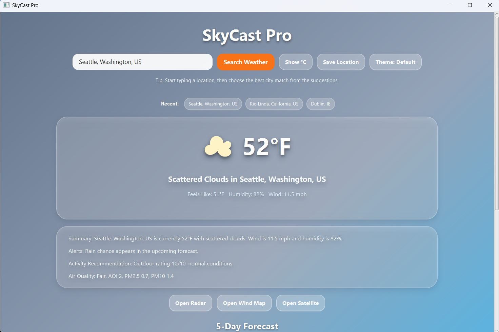
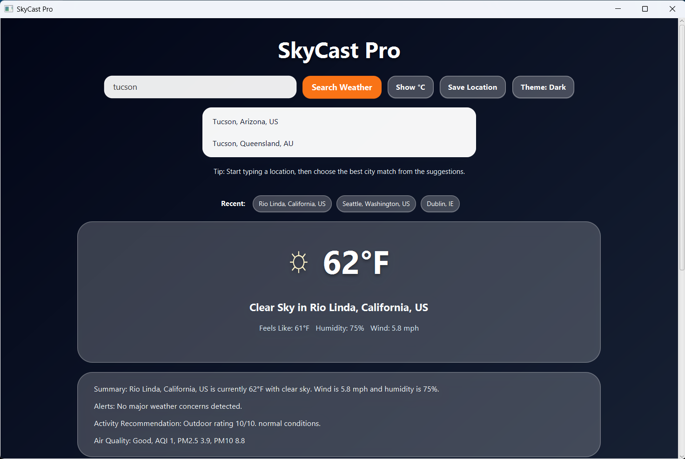
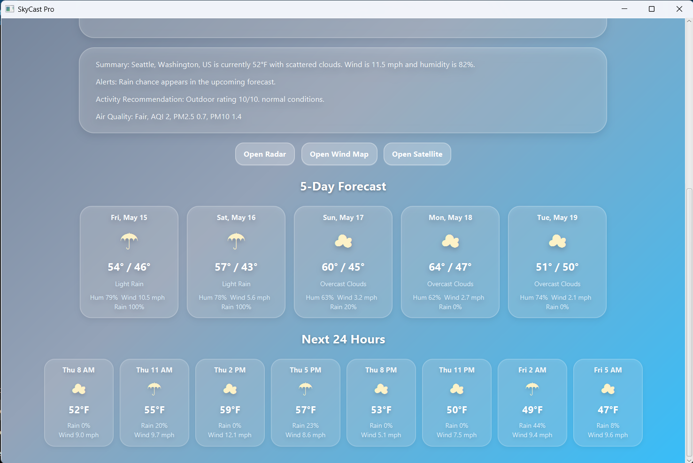
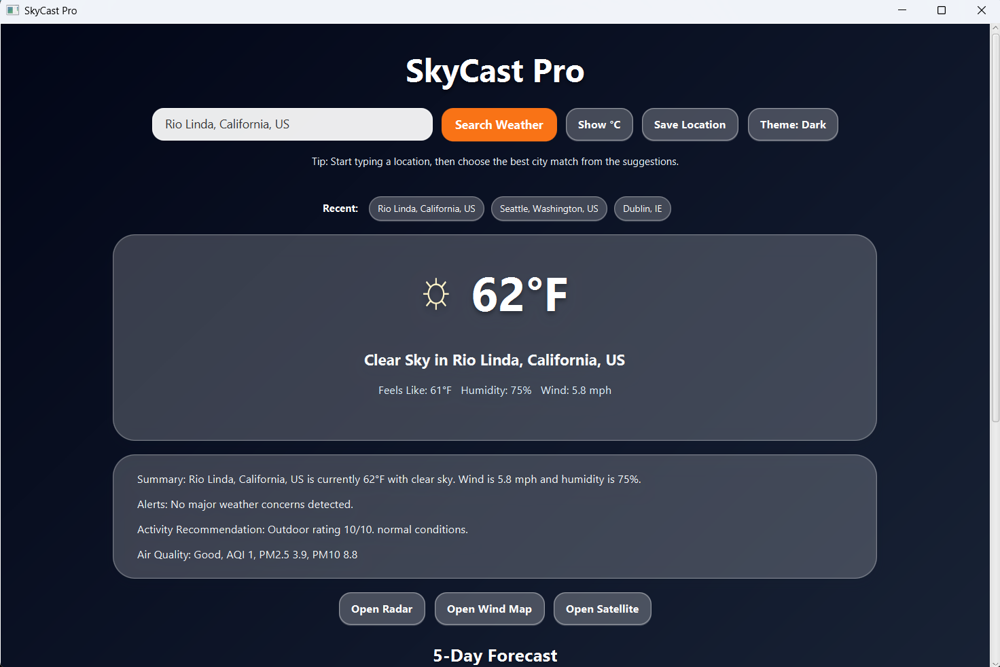

# SkyCast Pro

SkyCast Pro is a modern JavaFX weather dashboard that provides live weather data, smart location search, 5-day forecasts, hourly forecasts, air quality information, saved locations, recent searches, weather-based backgrounds, and external weather map links.

This project was built as a Java portfolio application to demonstrate API integration, JavaFX UI development, Maven project structure, local configuration management, user-focused design, and clean code organization.

## Screenshots

### Dashboard



### Location Suggestions



### Forecast View



### Dark Theme



## Features

- Live current weather by city, state, and country
- Smart location search suggestions using OpenWeatherMap geocoding
- Supports lowercase and partial city searches
- Displays cleaned city, state, and country after search
- 5-day forecast
- Next 24-hour forecast
- Fahrenheit and Celsius toggle
- Wind speed conversion between mph and km/h
- Air quality data with AQI, PM2.5, and PM10
- Weather alerts based on temperature, wind, humidity, and rain chance
- Outdoor activity recommendation with a 1-10 rating
- Favorite locations
- Recent search history
- Dynamic weather-based backgrounds
- Default and dark theme options
- External map buttons for radar, wind, and satellite views
- API key protected through local configuration
- Scrollable UI for smaller screens

## Tech Stack

- Java
- JavaFX
- Maven
- OpenWeatherMap API
- Gson
- Java Preferences API
- VS Code

## Project Structure

```text
SkyCast-Pro/
├── pom.xml
├── README.md
├── .gitignore
├── screenshots/
│   ├── dashboard.png
│   ├── suggestions.png
│   ├── forecast.png
│   └── dark-theme.png
└── src/
    └── main/
        ├── java/
        │   └── com/
        │       └── skycast/
        │           ├── Main.java
        │           ├── api/
        │           │   └── WeatherService.java
        │           ├── config/
        │           │   └── AppConfig.java
        │           ├── storage/
        │           │   └── LocationStorage.java
        │           └── util/
        │               ├── MapLauncher.java
        │               ├── ThemeManager.java
        │               ├── WeatherFormatter.java
        │               ├── WeatherInsightBuilder.java
        │               └── WeatherSymbolMapper.java
        └── resources/
            └── styles.css
```

## Setup Instructions

### 1. Clone the repository

```bash
git clone https://github.com/BIngram17/SkyCast-Pro.git
cd SkyCast-Pro
```

### 2. Create an OpenWeatherMap API key

Create a free account at OpenWeatherMap and generate an API key.

The app uses OpenWeatherMap for:

- Current weather
- 5-day forecast
- Geocoding/location suggestions
- Air quality data

### 3. Create `local.properties`

In the project root, create a file named:

```text
local.properties
```

Add your API key:

```properties
OPENWEATHER_API_KEY=your_openweather_api_key_here
```

`local.properties` is ignored by Git so API keys are not pushed to GitHub.

### 4. Run the project

Use Maven:

```bash
mvn clean compile
mvn javafx:run
```

## API Key Safety

This project does not hardcode the API key inside the source code.

The API key is loaded from one of these locations:

1. Environment variable:

```text
OPENWEATHER_API_KEY
```

2. Java system property:

```text
OPENWEATHER_API_KEY
```

3. Local project file:

```text
local.properties
```

The recommended local development option is `local.properties`.

## Example Searches

Try searching:

```text
Rio Linda
Sacramento
New York
Dallas
Laplace
```

For best accuracy, select one of the suggested city results from the dropdown.

## Key Classes

### `Main.java`

Handles the JavaFX user interface and user interactions.

### `WeatherService.java`

Handles API calls to OpenWeatherMap for weather, forecast, geocoding, and air quality data.

### `AppConfig.java`

Loads the API key from an environment variable, Java system property, or `local.properties`.

### `LocationStorage.java`

Handles favorite locations and recent search storage.

### `WeatherFormatter.java`

Formats temperatures, temperature ranges, and wind speed.

### `WeatherInsightBuilder.java`

Builds plain-English summaries, weather alerts, and activity recommendations.

### `WeatherSymbolMapper.java`

Maps weather conditions to custom weather symbols.

### `ThemeManager.java`

Handles default and dark theme switching.

### `MapLauncher.java`

Opens external weather map views for radar, wind, and satellite layers.

## What This Project Demonstrates

This project demonstrates:

- Java desktop application development
- JavaFX layout and styling
- REST API integration
- JSON parsing with Gson
- Maven dependency management
- Config-based secret management
- Local persistence
- Clean class separation
- UI state management
- User-centered feature design

## Future Improvements

- Add packaged desktop installer
- Add unit tests for formatting, storage, and insight logic
- Add loading animations
- Add more detailed hourly forecast panels
- Add severe weather alert API integration if available
- Add GitHub Actions build verification
- Add user-selectable default location

## Author

Brian Ingram  
GitHub: [BIngram17](https://github.com/BIngram17)